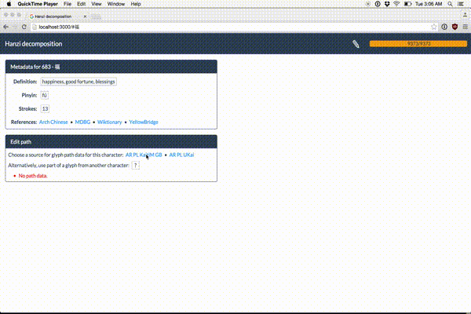

### [Make Me a Hanzi Demo](https://makemeahanzi.herokuapp.com)

### [New: Inkstone Chinese writing app](https://www.skishore.me/inkstone/)

### [New: No more cut-off strokes (due to @chanind)!](https://github.com/skishore/makemeahanzi/pull/32)

Make Me a Hanzi provides dictionary and graphical data for over 9000 of the
most common simplified and traditional Chinese characters. Among other things,
this data includes stroke-order vector graphics for all these characters. You
can see the project output at the [demo site](https://makemeahanzi.herokuapp.com)
where you can look up a characters by drawing them. You can also download the
data for use in your own site or app.

See the [project site](https://www.skishore.me/makemeahanzi) for general
information and updates on the project.

Make Me a Hanzi data is split into two data files,
[dictionary.txt](https://github.com/skishore/makemeahanzi/blob/master/dictionary.txt)
and [graphics.txt](https://github.com/skishore/makemeahanzi/blob/master/graphics.txt),
because the sources that the files are derived from have different licenses.
In addition, we provide an experimental tarball of animated SVGs,
[svgs.tar.gz](https://github.com/skishore/makemeahanzi/blob/master/svgs.tar.gz)
that is licensed the same way as graphics.txt.
See the Sources section and the
[COPYING](https://github.com/skishore/makemeahanzi/blob/master/COPYING)
file for more information.

### Sources

- dictionary.txt is derived from data from
  [Unihan](http://unicode.org/charts/unihan.html)
  and [CJKlib](https://github.com/cburgmer/cjklib).

- graphics.txt and svgs.tar.gz are derived from two free fonts:
  [Arphic PL KaitiM GB](https://apps.ubuntu.com/cat/applications/precise/fonts-arphic-gkai00mp/)
  and [Arphic PL UKai](https://apps.ubuntu.com/cat/applications/fonts-arphic-ukai/).

This project would not have been possible without the generosity of
[Arphic Technology](http://www.arphic.com/), a Taiwanese font forge that
released their work under a permissive license in 1999.

In addition, I would like to thank Gábor Ugray for his thoughtful advice on
the project and for verifying stroke data for most of the traditional
characters in the two data sets. Gábor maintains [Zydeo](http://zydeo.net/),
a free and open-source Chinese dictionary.

### Format

Both dictionary.txt and graphics.txt are '\n'-separated lists of lines, where
each line is JSON object. They differ in which keys are present, but the
common key, 'character', can be used to join the two data sets. You can also
rely on the fact that the two files will always come in the same order.

#### dictionary.txt keys:

- __character:__ The Unicode character for this glyph. Required.

- __definition:__ A String definition targeted towards second-language
  learners. Optional.

- __pinyin__ A comma-separated list of String pronunciations of this character.
  Required, but may be empty.

- __decomposition:__ An [Ideograph Description Sequence](https://en.wikipedia.org/wiki/Chinese_character_description_languages#Ideographic_Description_Sequences)
  decomposition of the character. Required, but invalid if it starts with a
  full-width question mark '？'.

    Note that even if the first character is a
    proper IDS symbol, any component within the decomposition may be a wide
    question mark as well. For example, if we have a decomposition of a
    character into a top and bottom component but can only recognize the top
    component, we might have a decomposition like so: '⿱逢？'

- __etymology:__ An etymology for the character. This field may be null. If
  present, it will always have a "type" field, which will be one of
  "ideographic", "pictographic", or "pictophonetic".
  If the type is one of the first two options, then the etymology will
  always include a string "hint" field explaining its formation.

  If the type is "pictophonetic", then the etymology will contain three
  other fields: "hint", "phonetic", and "semantic", each of which is
  a string and each of which may be null. The etymology should be read as:
      ${semantic} (${hint}) provides the meaning while ${phonetic}
      provides the pronunciation.
  with allowances for possible null values.

- __radical:__ Unicode primary radical for this character. Required.

- __matches:__
  A list of mappings from strokes of this character to strokes of its
  components, as indexed in its decomposition tree. Any given entry in
  this list may be null. If an entry is not null, it will be a list of
  indices corresponding to a path down the decomposition tree.

  This schema is a little tricky to explain without an example. Suppose
  that the character '俢' has the decomposition: '⿰亻⿱夂彡'

  The third stroke in that character belongs to the radical '夂'.
  Its match would be [1, 0]. That is, if you think of the decomposition as
  a tree, it has '⿰' at its root with two children '亻' and '⿱', and
  '⿱' further has two children '夂' and '彡'. The path down the tree
  to '夂' is to take the second child of '⿰' and the first of '⿱',
  hence, [1, 0].

  This field can be used to generate visualizations marking each component
  within a given character, or potentially for more exotic purposes.

#### graphics.txt keys:

- __character:__ The Unicode character for this glyph. Required.

- __strokes:__
  List of SVG path data for each stroke of this character, ordered by
  proper stroke order. Each stroke is laid out on a 1024x1024 size
  coordinate system where:
    - The upper-left corner is at position (0, 900).
    - The lower-right corner is at position (1024, -124).

  Note that the y-axes DECREASES as you move downwards, which is strage!
  To display these paths properly, you should hide render them as follows:

      <svg viewBox="0 0 1024 1024">
        <g transform="scale(1, -1) translate(0, -900)">
          <path d="STROKE[0] DATA GOES HERE"></path>
          <path d="STROKE[1] DATA GOES HERE"></path>
          ...
        </g>
      </svg>

- __medians:__
  A list of stroke medians, in the same coordinate system as the SVG
  paths above. These medians can be used to produce a rough stroke-order
  animation, although it is a bit tricky. Each median is a list of pairs
  of integers. This list will be as long as the strokes list.

### TODOs and Future Work

- As an experimental next step, we have produced an animated SVG image for
  each character that we have data for (see the svgs directory). The SVGs are
  named by the Unicode codepoint of the character they correspond to.
  Using Javascript, you can find the codepoint of a character `x` by calling
  `x.charCodeAt(0)`. It's easy to embed these SVGs in a website. A minimal
  example is as follows:

      <body><embed src="31119.svg" width="200px" height="200px"/></body>

  This feature is experimental because it is still tricky to work with these
  images beyond this basic example. For instance, it's not clear how to
  embed two of these images side-by-side and have the second start animating
  when the first is complete. However, the images are still the easiest way
  to make use of this data..

There are quite a few clients using the Make Me a Hanzi data. Many of them
have had to do additional preprocessing of it for their use case. If you might
find this data useful, please feel free to contact me by email - I may be able
to give tips or suggest algorithms for making use of it.

### Related projects

- This project is focused on building stroke order diagrams that follow the
  People's Republic of China (PRC) stroke order. Some characters are written
  with different stroke orders in Japan, Taiwan, and elsewhere. I don't have
  the time or knowledge to produce similar data for those orderings, but
  there are other resources that you can try:

    - parsimohni's animCJK project provides Japanese stroke order data: [GitHub](https://github.com/parsimonhi/animCJK) and [Demo](http://gooo.free.fr/animCJK/official/)
    - KanjiVG also has Japanese stroke order data, and isn't based on Arphic's font: [Website](http://kanjivg.tagaini.net/)
    - chanind's Hanzi Writer Javascript library supports animations and writing practice: [Website](https://chanind.github.io/hanzi-writer/)

- There are also some apps and websites that use this data:

    - gugray maintains HanDeDict, a Chinese-German dictionary that uses these animations: [GitHub](https://github.com/gugray/HanDeDict/) and [Website](https://handedict.zydeo.net/de)
    - meshonline wrote a free iOS app for learning Chinese characters using this data: [GitHub](https://github.com/meshonline/Hanzi) and [App Store](https://itunes.apple.com/us/app/%E7%B9%81%E4%BD%93%E5%AD%97%E5%B8%96/id1333520855?l=zh&ls=1&mt=8)
    - embermitre uses Make Me a Hanzi animations in Hanping Chinese Dictionary: [Lite version](https://play.google.com/store/apps/details?id=com.embermitre.hanping.app.lite) and [Pro version](https://play.google.com/store/apps/details?id=com.embermitre.hanping.app.pro)
